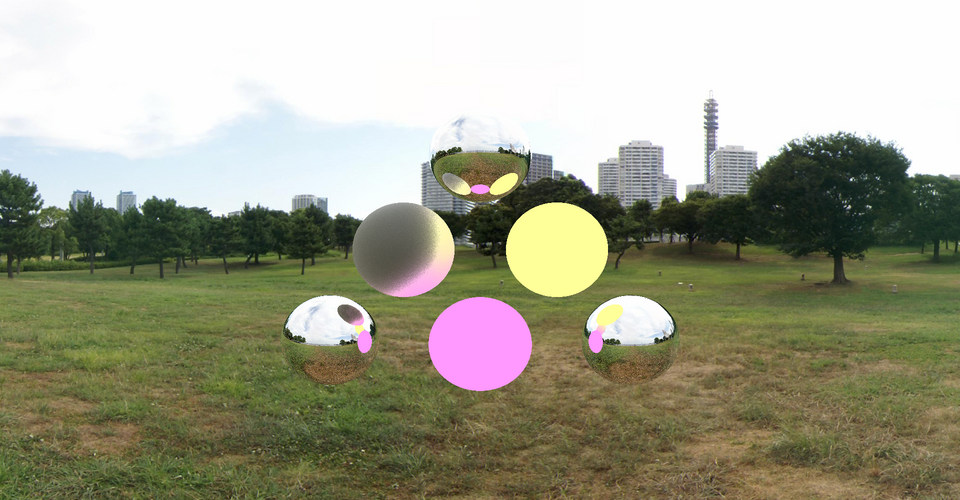

# raytracer21

Рейтрейсер, написаный на чистом c++ без использования каких-либо сторонних библиотек.



## Реализованные фичи
- Простой [тредпул](src/threadpool/ThreadPool.cpp) для многопоточного рендеринга
- [Зеркальные](src/raytracer/surfaces/Reflective.hpp) поверхности
- Поверхности [Фонга](src/raytracer/surfaces/Phong.hpp)
- Рендеринг окружения через [cubemap](src/raytracer/Sky.hpp)
- Чтение и запись файлов в формате [Netpbm](src/image/PPMImage.cpp)

## Сборка
```
mkdir -p build && cmake .. && make 
```